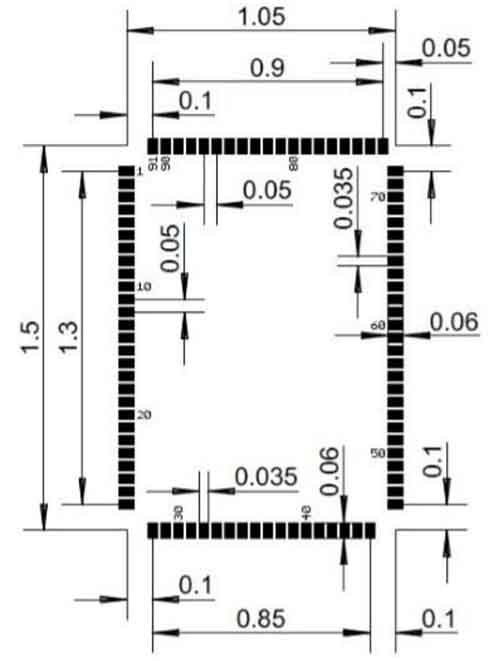
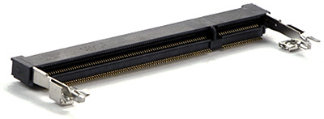

# SITCore System on Modules
---

## Overview
The SITCore SoMs provide a low cost way to add .NET computing power to any embedded product. They are available as a 200 pin SO-DIMM with and without Wi-Fi (G400 compatible), a 91 pad surface mount module (G120 compatible), or a 105 pad surface mount module (G120E compatible). The SITCore SoMs let's you design IoT products that are secure, easily integrated with the cloud, and can be easily managed and updated from the cloud for deployments of one to a million or more. The surface mount versions are great for harsh or high vibration environments.

## Ordering Part Number
* 91 Pad Surface Mount: SC20260N
* 105 Pad Surface Mount: SC20260E
* 200 Pin SO-DIMM: SC20260D
* 200 Pin SO-DIMM with Wi-Fi: SC20260DW

## Specifications

| Spec               | All SITCore SoMs          |
|--------------------|---------------------------|
| Processor          | STM32H743XIH6             |
| Processor Type     | ARM Coretex-M7 32 Bit     |
| Speed              | 480 MHz                   |
| Internal RAM       | 1 MByte                   |
| Internal Flash     | 2 MByte                   |
| Instruction Cache  | 16 KByte                  |
| Data Cache         | 16 KByte                  |
| Temperature Range  | -40C to +85C              |

*Note: Resources are shared between your application and the operating system.*

## Peripherals

| Peripheral            | SC2026N     | SC20260E    | SC20260D    | SC20260DW   |
|-----------------------|-------------|-------------|-------------|-------------|
| GPIO (all support IRQ)|             |             |             |             |
| SPI                   |             |             |             |             |
| I2C                   |             |             |             |             |
| UART                  |             |             |             |             |
| USART                 |             |             |             |             |
| CAN                   |             |             |             |             |
| PWM                   |             |             |             |             |
| ADC                   |             |             |             |             |
| DAC                   |             |             |             |             |
| SD/SDIP/MMC           |             |             |             |             |
| Quad SPI              |             |             |             |             |
| SAI                   |             |             |             |             |
| USB Host              |             |             |             |             |
| USB Client            |             |             |             |             |
| Ethernet              |             |             |             |             |
| LCD TFT               |             |             |             |             |
| Camera                |             |             |             |             |

*Note: As many pins share peripherals, not all peripherals will be available.*

## Features

* Low power modes including three independently controllable power domains
* RTC
* Watchdog
* Threading
* TCP/IP with SSL
  * Full .NET socket interface
  * Ethernet
  * PPP
* Graphics
  * Images
  * Fonts
  * Controls
* File System
  * Full .NET file interface
  * SD cards
  * USB drives
* Native extensions
  * Runtime Loadable Procedures
  * Device register access
* Signal controls
  * Generation
  * Capture
  * Pulse measurement
    
## Pinout

## Device Startup
The SITCore is held in reset when the reset pin is low. Releasing it will begin the system startup process.

There are three different components of the device firmware:
1. GHI Bootloader: initializes the system, updates TinyCLR when needed, and executes TinyCLR.
2. TinyCLR: loads, debugs, and executes the managed application.
3. Managed application: the program developed by the customer.

Which components get executed on startup can be control by manipulating the LDR0 pin. It is pulled high on
startup. When low, the device waits in the GHI Bootloader. Otherwise, the managed application is executed. LDR1
is reserved for future use.

Additionally, the communications interface between the host PC and the SITCore is selected on startup through the
MODE pin, which is pulled high on startup. The USB interface is selected when MODE is high and COM1 is selected
when MODE is low.

The above discussed functions of LDR0, LDR1, and MODE are only during startup. After startup, they return to the
default GPIO state and are available to use as GPIO in the user application

## TinyCLR OS
TinyCLR OS provides a way to program the G80 in C# or Visual Basic from the Microsoft Visual Studio integrated development environment.  To get started you must first install the firmware on the G80 (instructions below) and then go to the TinyCLR [Getting Started](../../software/tinyclr/getting-started.md) page for instructions.

### Loading the Firmware

1. Activate the bootloader, hold the LDR0 signal low while resetting the board.
2. Open [TinyCLR Config](../../software/tinyclr/tinyclr-config.md) tool.
3. Click the loader tab.
4. Select the correct COM port. If you are not seeing it then the device is not in the loader mode.
5. Click the `Update to Latest` button.

You can also update the firmware manually. Download the [firmware](../../software/tinyclr/downloads.md) and learn how to use the [GHI Bootloader](../../hardware/loaders/ghi-bootloader.md) manually

### Loading the Bootloader
1. Download the SITCore bootloader [here](../../hardware/loaders/ghi-bootloader.md).
2. Connect your device to the USB client port.
3. Put the board in DFU mode: Hold the SYS A pin low and press/release the reset button. Wait for a second then release SYS A. Windows *Device Manager* will now show "STM Device in DFU Mode" under the 'Universal Serial Bus controller' TAB.
4. Go to the [STM32 Bootloader](../../hardware/loaders/stm32-bootloader.md) to learn how to upload DFU files.

### Loading the Firmware
1. Activate the bootloader, hold the LDR0 signal (SYS B) low while resetting the board.
2. Open [TinyCLR Config](../../software/tinyclr/tinyclr-config.md) tool.
3. Click the loader tab.
4. Select the correct COM port. If you are not seeing it then the device is not in the loader mode.
5. Click the `Update to Latest` button.

You can also update the firmware manually. Download the [firmware](../../software/tinyclr/downloads.md) and learn how to use the [GHI Bootloader](../../hardware/loaders/ghi-bootloader.md) manually.

### Start Coding
Now that you have installed the bootloader and firmware on the SITCore, you can setup your host computer and start programming.  Go to the TinyCLR [Getting Started](../../software/tinyclr/getting-started.md) page for instructions.

### Native Code
You have the choice of loading the module with your preferred RTOS. Also, you can load [Native Code](../../software/tinyclr/native/intro.md) in TinyCLR OS at runtime that works alongside your managed application. Native code can be used to provide improved performance or access to advanced features.

The memory area reserved for native code in TinyCLR OS on SITCore starts at 0xC1F00000???? and its length is 0xFFFF8????.

## Datasheet

## Design Considerations

## Footprints

We recommend no traces or vias under the module. Dimensions are in inches.

### SC20260N Recommended Footprint

### SC20260E Recommended Footprint

### SC20260D / SC20260DW SO-DIMM Socket

The SC20260D and SC20260W use the same 200 pin SO-DIMM socket that was originally made for DDR2 memory modules. You can make a custom SO-DIMM SITCore circuit board by adding the appropriate SO-DIMM socket to your circuit board.

> [!Tip]
> Make sure to expose the required pins in your design. Specific pins are needed for device programming, updates, recovery, and Wi-Fi firmware updates. See device specifications for details.

SO-DIMM stands for Small Outline Dual Inline Memory Module. There are two different 200 pin SO-DIMM sockets, those made for DDR memory and those made for DDR2 memory. They are identical except for the orientation notch which is in a slightly different position. These sockets are not interchangeable. There is also a 204 pin SO-DIMM socket for DDR3 memory with the notch positioned closer to the center of the module.

> [!Note]
> Our UCMs are only compatible with DDR2 type 200 pin SO-DIMM sockets.

Here is a link to the manufacturer's web page for the connector we use on our boards: [EMBOSS ASSY DDR2 SODIMM SOCKET 200P 5.2H](http://www.te.com/usa-en/product-1565917-4.html)

### Required Pins
Exposing the following pins is required in every design to enable device programming, updates, and recovery:
* LDR0
* LDR1
* Reset
* Desired debug interface(s)
* MODE if required to select a debug interface

### Power Supply
A typical clean power source, suited for digital circuitry, is needed to power the SITCore SoCs. Voltages should be within at
least 10% of the specified voltage. Decoupling capacitors of 0.1 uF are needed near every power pin. Additionally, a
large capacitor, typically 47 uF, should be near the G80 if the power supply is more than few inches away.

### Crystals
The SITCore requires an external 8 MHz crystal and associated circuitry to function. For the RTC to function, a 32,768
Hz crystal and circuitry are required. Please see the processor's documentation for advanced information.

### Reset
The reset pin is not pulled in any direction. Designs must be sure to use an appropriate pull-up resistor.

### Oven Reflow Profile

## SITCore Development Board
