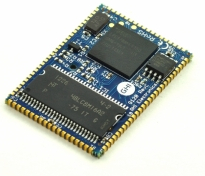
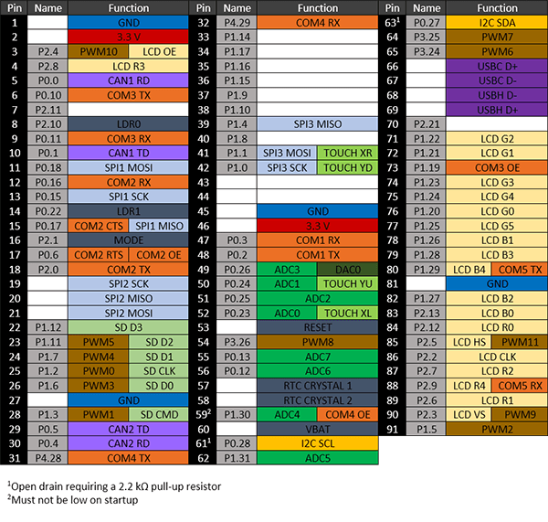
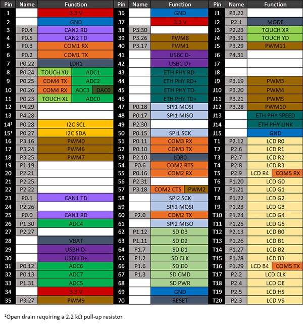
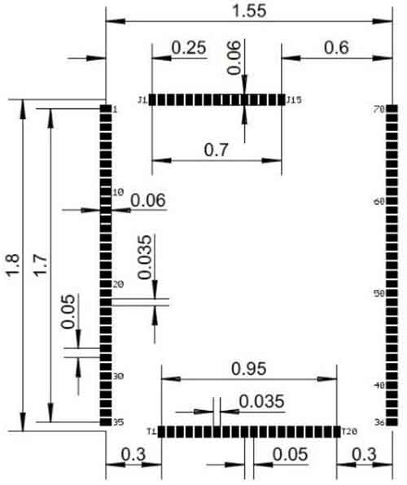

# G120 / G120E
---

## Overview

The G120 and G120E SoMs are powerful, low-cost, System on Modules part of the GHI Electronics Surface Mount Compute Modules (SCM) line. These modules can be programmed in .NET C# and Visual Basic using .NET Micro Framework.

> [!Tip]
> Not recommended for new designs, consider SITCore [System on Chip](../sitcore/soc.md).

## Ordering Part Number
* G120 SoM: G120B-SM-373
* G120E SoM: G120E-SM-532
* G120E Dev Board: G120D-SM-533

## G120 vs G120E

|                    | G120                               |G120E                           |
|--------------------|------------------------------------|--------------------------------|
| Processor          | NXP LPC1788FET180                  | NXP LPC1788FET208              |
| Package            | 91 pin surface-mount module (SMT)  | 120 MHz                        |
| Dimensions         | 38.1 x 26.7 x 3.5 mm               | 45.8 x 39.4 x 4.4 mm           |
| RTC                | External 32,768 Hz crystal         | Included                       |
| GPIO               | 72                                 | 80                             |
| SPI                | 3                                  | 2                              |
| Ethernet           | ENC28J60 over SPI                  | ENC28J60 over SPI and/or       |
|                    |                                    | Built-in base 100 Ethernet PHY |

## Specifications

| Spec               | Value                     |
|--------------------|---------------------------|
| Processor          | NXP LPC1788FET            |
| Speed              | 120 MHz                   |
| Internal RAM       | 96 KByte (SRAM)           |
| Internal Flash     | 512 KByte                 |
| External RAM       | 16 MByte (DRAM)           |
| External Flash     | 4 MByte (SPI)             |
| Dimensions (G120)  | 38.1 x 26.7 x 3.5 mm      |
| Dimensions (G120E) | 45.8 x 39.4 x 4.4 mm      |
| Temperature Range  |  -40 C to +85 C           |

*Note: Resources are shared between your application and the operating system.*

## Features

* .NET Micro Framework
* RoHS Lead Free
* 120 MHz ARM Cortex-M3 NXP LPC1788
* 6 MBytes available RAM
* 2.3 MBytes available flash
* Embedded LCD controller
* 72 to 80 GPIO
* 43 interrupt capable GPIO
* 2 to 3 SPI
* 1 I2C
* 5 UART
* 2 CAN
* 12 PWM
* 8 12-bit analog input
* 1 10-bit analog output
* 4-bit SD/MMC memory card interface
* Low power modes
* RTC
* Watchdog
* Threading
* USB host
* USB client
* SQLite database
* TCP/IP with SSL
  * Full .NET socket interface
  * Ethernet
  * WiFi
  * PPP
* Graphics
  * Images
  * Fonts
  * Controls
* File System
  * Full .NET file interface
  * SD cards
  * USB drives
* Native extensions
  * Runtime Loadable Procedures
  * Device register access
* Signal controls
  * Generation
  * Capture
  * Pulse measurement

## G120 Pinout

Many signals on the G120 are multiplexed to offer multiple functions on a single pin. Developers can decide on the pin functionality to be used through the provided libraries. Any pin with no name, function, or note must be left unconnected.

## G120E Pinout

## Footprints

We recommend no traces or vias under the module. Dimensions are in inches.

### G120 Recommended Footprint

### G120E Recommended Footprint

## Device Startup

The G120 is held in reset when the reset pin is low. Releasing it will begin the system startup process. It is pulled
high internally on the G120E and left floating on the G120.
There are four different components of the device firmware:
1. GHI Electronics Bootloader: initializes the system, updates TinyBooter when needed, and executes TinyBooter.
2. TinyBooter: executes NETMF, updates NETMF when needed, and updates the system configuration.
3. NETMF: loads, debugs, and executes the managed application.
4. Managed application: the program developed by the customer.

Which components get executed on startup can be control by manipulating the LDR0 and LDR1 pins. LDR0 and
LDR1 are pulled high on startup.

| LDRO               | LDR1      |Effect                            |
|--------------------|-----------|----------------------------------|
| Ignored            | High      | Execute the managed application  |
| High               | Low       | Wait in TinyBooter               |
| Low                | Low       | Wait in GHI Electronics Bootloader |

Additionally, the communications interface between the host PC and the G120 is selected on startup through the
MODE pin, which is pulled high on startup

| MODE               | G120      | G120E                            |
|--------------------|-----------|----------------------------------|
| High               | USB       | COM1                             |
| Low                | COM1      | USB                              |

The above discussed functions of LDR0, LDR1, and MODE are only during startup. After startup, they return to the
default GPIO state and are available to use as GPIO in the user application.

## .NET Micro Framework (NETMF)

The NETMF software on G120 is mature and complete. For more information on NETMF you can go to the [NETMF Introduction](../../software/netmf/intro.md) page.  The [NETMF Getting Started](../../software/netmf/getting-started.md) page covers NETMF from setup of the host computer to program deployment on both an emulator and target device.

### Loading the Firmware

1. Activate the bootloader, hold the LDR0 signal low while resetting the board.
2. Open FEZ Config tool and follow the instructions.

You can also update the firmware manually. See [GHI Electronics Bootloader](../../software/netmf/bootloader.md) page.

### Start Coding

Now that you have installed the bootloader and firmware on the G120, you can setup your host computer and start programming. Go to the NETMF [Getting Started](../../software/netmf/getting-started.md) page for instructions.

## Datasheet

This documentation page replaced the legacy datasheet PDF but it is [here](http://files.ghielectronics.com/downloads/Documents/Datasheets/G120%20and%20G120E%20Datasheet.pdf) for reference.

## CAN Bit Timing Settings

The following CAN bit timing parameters were calculated for a G120 driving the SN65HVD230 CAN driver chip. See the [CAN Tutorial](../../software/netmf/tutorials/can.md) for more information.

| Baud | Propagation | Phase1 | Phase2 | Baudrate Prescaler | Synchronization Jump Width | Use Multi Bit Sampling | Sample Point | Max Osc. Tolerance | Max Cable Length
|---|---|---|---|---|---|---|---|---|---
| 33.333K | 1 | 12 | 2 | 120 | 1 | False | 86.7% | 0.33% | 2145M
| 83.333K | 1 | 13 | 2 | 45  | 1 | False | 87.5% | 0.31% | 845M
| 125K    | 1 | 13 | 2 | 30  | 1 | False | 87.5% | 0.31% | 545M
| 250K    | 1 | 13 | 2 | 15  | 1 | False | 87.5% | 0.31% | 245M
| 500K    | 1 | 12 | 2 | 8   | 1 | False | 86.7% | 0.33% | 92M
| 1M      | 1 | 12 | 2 | 4   | 1 | False | 86.7% | 0.33% | 18M

*Note: Maximum Oscillator Tolerance and Maximum Cable Length are theoretical maximums and must be tested t*ensure reliability.*

## Design Considerations

### Required Pins

Exposing the following pins is required in every design to enable device programming, updates, and recovery:
* LDR0
* LDR1
* Reset
* Desired debug interface(s)
* MODE if required to select a debug interface

### Power Supply

A typical clean power source, suited for digital circuitry, is needed to power the G120. Voltages should be within at
least 10% of the needed voltage. Decoupling capacitors of 0.1 μF are needed near every power pin. Additionally, a
large capacitor, typically 47 μF, should be near the G120 if the power supply is more than few inches away.

### Crystals

The G120 and G120E include the needed system crystal and its associated circuitry. The G120E additionally
includes the RTC crystal and its associated circuitry. However, the G120 does not. It requires an external 32,768 Hz
crystal and circuitry for the RTC to function. Please see the processor’s documentation for advanced information.

### Interrupt Pins

Only pins on ports 0 and 2 support interrupts. 

### Reset

The G120E includes an internal pull-up resistor on the reset pin. The G120 does not, so an external 15 kΩ pull-up
resistor is required for correct operation.

### SPI Channels

SPI2 is shared internally with the flash memory on the G120. Use of a chip select with devices on this channel is
required or the G120 will not function properly. The use of another SPI channel is recommended.

### Ethernet

The built in Ethernet available on the G120E includes all needed Ethernet circuitry internally. However, an
appropriate magnet and connector, like the J0011D or similar, are required.

### Oven Reflow

The G120 is not sealed for moisture. Baking the module before reflow is recommended and required in a humid
environment. The process of reflow can damage the G120 if the temperature is too high or exposure is too long.

The lead-free reflow profiles used by GHI Electronics are shown below. The profiles are based on [AIM](https://www.aimsolder.com/) SAC 305
solder (3% silver, 0.5% copper). The thermal mass of the assembled board and the sensitivity of the components
on it affect the total dwell time. Differences in the two profiles are where they reach their respective peak
temperatures as well as the time above liquids (TAL). The shorter profile applies to smaller assemblies, whereas
the longer profile applies to larger assemblies such as back-planes or high-density boards. The process window is
described by the shaded area. These profiles are only starting-points and general guidance. The particulars of an
oven and the assembly will determine the final process.

## G120 Development Board

The G120E Dev Board is an excellent starting point and reference design for anyone interested in evaluating and
developing with the G120/G120E.

 

* [Schematic](http://files.ghielectronics.com/downloads/Schematics/Systems/G120E%20Dev%20Board%20Rev%201.2%20Schematic.pdf)

***

You can also visit our main website at [**www.ghielectronics.com**](http://www.ghielectronics.com) and our community forums at [**forums.ghielectronics.com**](https://forums.ghielectronics.com/).
