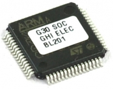

# G30
---

## Overview

The G30 SoC is a low-cost System on Chip part of the GHI Electronics SurfaceMount Compute Modules (SCM) line. This modules can be programmed in .NET C# and Visual Basic using .NET Micro Framework.

> [!Tip]
> Not recommended for new designs, consider SITCore [System on Chip](../sitcore/soc.md).

## Ordering Part Number
* G30 SoC: 30SOC-SC-539
* G30 Dev Board: G30DB-SM-555

## Specifications

| Spec               | Value                     |
|--------------------|---------------------------|
| Processor          | STM ST32F401RET6          |
| Speed              | 84 MHz                    |
| Internal RAM       | 96 KByte (SRAM)           |
| Internal Flash     | 512 KByte                 |
| Package            | LQFP64 10 x 10 mm         |
| Temperature Range  | -40C to +85C              |

*Note: Resources are shared between your application and the operating system.*

## Features

* .NET Micro Framework
* RoHS Lead Free
* 84 MHz ARM Cortex-M4 STM32F401RET6
* 68 Kbytes available RAM
* 128 Kbytes available flash
* 49 GPIO
* 16 interrupt capable GPIO
* 2 SPI
* 1 I2C
* 2 UART
* 15 PWM
* 16 12-bit analog input
* 4-bit SD/MMC memory card interface
* Low power modes
* LQFP64 10 x 10 mm
* RTC
* Watchdog
* Threading
* USB client
* File System
  * Full .NET file interface
  * SD cards
* Native extensions
  * Device register access
* Signal controls
  * Generation
  * Capture
  * Pulse measurement

## G30 Pinout

Many signals on the G30 are multiplexed to offer multiple functions on a single pin. Developers can decide on the pin functionality to be used through the provided libraries. Any pin with no name, function, or note must be left unconnected.

## Footprint

The chip is standard LQFP64 10x10mm. See the ST32F401RET6 datasheet for exact footprint.

## Device Startup

The G30 is held in reset when the reset pin is low. Releasing it will begin the system startup process.

There are three different components of the device firmware:
1. GHI Electronics Bootloader: initializes the system, updates NETMF firmware when needed, and executes NETMF.
2. NETMF Firmware: loads, debugs, and executes the managed application.
3. Managed application: the program developed by the customer.

Which components get executed on startup can be control by manipulating the LDR0 pin. It is pulled high on
startup. When low, the device waits in the GHI Electronics Bootloader. Otherwise, the managed application is executed. LDR1
is reserved for future use.

Additionally, the communications interface between the host PC and the G30 is selected on startup through the
MODE pin, which is pulled high on startup. The USB interface is selected when MODE is high and COM1 is selected
when MODE is low.

The above discussed functions of LDR0, LDR1, and MODE are only during startup. After startup, they return to the
default GPIO state and are available to use as GPIO in the user application.

## .NET Micro Framework
NETMF provides a way to program the G30 in C# or Visual Basic from the Microsoft Visual Studio integrated development environment.  To get started you must first install the NETMFfirmware (instructions below) and then go to the NETMF [Getting Started](../../software/netmf/getting-started.md) page for instructions.

### Loading the Firmware

1. Activate the bootloader, hold the LDR0 signal low while resetting the board.
2. Open FEZ Config tool and follow the instructions.

You can also update the firmware manually. See [GHI Electronics Bootloader](../../software/netmf/bootloader.md) page.

### Start Coding

Now that you have installed the firmware on the G30, you can setup your host computer and start programming.  Go to the NETMF [Getting Started](../../software/netmf/getting-started.md) page for instructions.

## Datasheet
This documentation page replaced the legacy datasheet PDF but it is [here](http://files.ghielectronics.com/downloads/Documents/Datasheets/G30%20Datasheet.pdf) for reference.

## Design Considerations

### Required Pins

Exposing the following pins is required in every design to enable device programming, updates, and recovery:

* LDR0
* LDR1
* Reset
* Desired debug interface(s)
* MODE if required to select a debug interface

### Power Supply

A typical clean power source, suited for digital circuitry, is needed to power the G30. Voltages should be within at
least 10% of the needed voltage. Decoupling capacitors of 0.1 μF are needed near every power pin. Additionally, a
large capacitor, typically 47 μF, should be near the G30 if the power supply is more than few inches away.

### Crystals

The G30 requires an external 12 MHz crystal and associated circuitry to function. For the RTC to function, a 32,768
Hz crystal and circuitry are required. Please see the processor’s documentation for advanced information.

### Interrupt Pins

Interrupts are only available on 16 pins at any given time. Of those 16 pins, the pin number must be unique. For
example: PA1 and PB1 cannot both be used as interrupts at the same time, but PA1 and PB2 can.

### Reset

The reset pin is not pulled in any direction. Designs must be sure to use an appropriate pull-up resistor.

## G30 Development Board

The G30 Dev Board is an excellent starting point and reference design for anyone interested in evaluating and developing with the G30.

* [Schematic](http://files.ghielectronics.com/downloads/Schematics/Systems/G30%20Dev%20Board%20Rev%201.0%20Schematic.pdf)

***

You can also visit our main website at [**www.ghielectronics.com**](http://www.ghielectronics.com) and our community forums at [**forums.ghielectronics.com**](https://forums.ghielectronics.com/).
