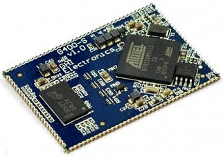
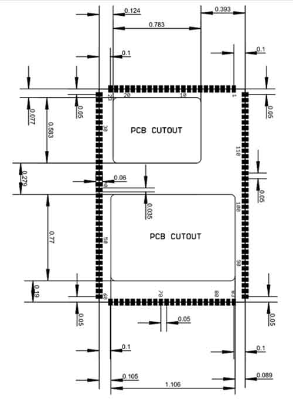
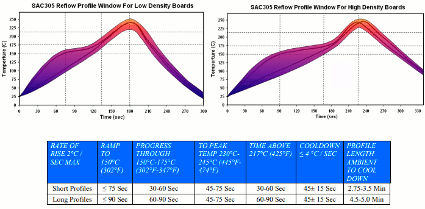

# G400S
---

## Overview

The G400S System on Module (SoM) is the surface mount version of the G400D. The G400D can be programmed in .NET C# and Visual Basic using .NET Micro Framework.

> [!Tip]
> Not recommended for new designs, consider SITCore [System on Chip](../sitcore/soc.md).

## Ordering Part Number
* G400S SoM: G400S-SM-480

## Specifications

| Spec              | Value                     |
|-------------------|---------------------------|
| Processor         | Atmel AT91SAM9X35 ARM 926 |
| Speed             | 400 MHz                   |
| Internal RAM      | 32 KByte (SRAM)           |
| Internal Flash    | 0 KByte                   |
| External RAM      | 128 MByte (DDR2 SDRAM)    |
| External Flash    | 4 MByte (SPI)             |
| Dimensions        | 48.3 x 33.1 x 4.6 mm      |
| Temperature Range | -40 C to +85 C            |

*Note: Not all memory will be available for your application.*

## Peripherals

*Note:  Many peripherals share I/O pins.  Not all peripherals will be available to your application.*

* .NET Micro Framework
* RoHS Lead Free
* 400 MHz ARM 9 Atmel SAM9X35
* 64 MBytes available RAM
* 1.4 MBytes available flash
* Embedded LCD controller
* 89 interrupt capable GPIO
* 2 SPI
* 1 I2C
* 6 UART
* 2 CAN
* 4 PWM
* 12 10-bit analog output
* 4-bit SD/MMC memory card interface
* Low power modes
* RTC
* Watchdog
* Threading
* USB host
* USB client
* SQLite database
* TCP/IP with SSL
  * Full .NET socket interface
  * Ethernet
  * PPP
* Graphics
  * Images
  * Fonts
  * Controls
* File System
  * Full .NET file interface
  * SD cards
  * USB drives
* Native extensions
  * Runtime Loadable Procedures
  * Device register access
* Signal controls
  * Generation
  * Capture
  * Pulse measurement

## G400S Pinout

Many signals on the G400 are multiplexed to offer multiple functions on a single pin. Developers can decide on the pin functionality to be used through the provided libraries. Any pin with no name, function, or note must be left unconnected.

## Footprint

### G400S Recommended Footprint

## Device Startup

The G400 is held in reset when the reset pin is low. Releasing it will begin the system startup process. It is pulled
high internally

There are four different components of the device firmware:

1. GHI Electronics Bootloader: initializes the system, updates TinyBooter when needed, and executes TinyBooter.
2. TinyBooter: executes NETMF, updates NETMF when needed, and updates the system configuration.
3. NETMF: loads, debugs, and executes the managed application.
4. Managed application: the program developed by the customer.

Which components get executed on startup can be control by manipulating the LDR0 and LDR1 pins. LDR0 and
LDR1 are pulled high on startup.

| LDRO               | LDR1      |Effect                            |
|--------------------|-----------|----------------------------------|
| Ignored            | High      | Execute the managed application  |
| High               | Low       | Wait in TinyBooter               |
| Low                | Low       | Wait in GHI Electronics Bootloader |

Additionally, the communications interface between the host PC and the G400 is selected on startup through the
MODE pin, which is pulled high on startup. The USB interface is selected when MODE is high and UART1 is selected
when MODE is low.

The above discussed functions of LDR0, LDR1, and MODE are only during startup. After startup, they return to the
default GPIO state and are available to use as GPIO in the user application.

## .NET Micro Framework (NETMF)

The NETMF software on G400 is mature and complete. For more information on NETMF you can go to the [NETMF Introduction](../../software/netmf/intro.md) page.  The [NETMF Getting Started](../../software/netmf/getting-started.md) page covers NETMF from setup of the host computer to program deployment on both an emulator and target device.

Bootloader v1 is needed for G400 to work with NETMF. It is available in the NETMF SDK.

### Loading Bootloader Version 2

Download the [G400 bootloader v2 file](../../software/netmf/bootloader.md) and load onto the dataflash using the Microchip [SAM-BA tool](https://www.microchip.com/developmenttools/ProductDetails/PartNO/SAM-BA%20In-system%20Programmer) and the following instructions.

To set the chip in SAM-BA mode, hold down the dedicated button on your board (SYS A on UCM Dev and Breakout boards) while the system powers up (or during reset). If there is no such button, connect G400S pin SPI1_MISO to ground. Keep the button pressed (pin grounded) for three seconds after power up or reset, then release the pin. The device manager will show a COM port similar to "Bossa Program Port" or "GPS Detect".

1. If it is not already installed, download and install the [SAM-BA tool](https://www.microchip.com/developmenttools/ProductDetails/PartNO/SAM-BA%20In-system%20Programmer) from Microchip. The latest version we have tested is 2.18 for Windows. (The tool may not show correctly. Try to make the window larger to see all hidden buttons!)
2. Open the SAM-BA program then select the COM port for your device in the connection box and your board type below it (at91sam9x35-ek for G400), then click connect.
3. Near the middle of the window, go to the `DataFlash AT45DB/DCB` tab.
4. Under `Scripts`, select `Enable Dataflash (SPI0 CS0)` then click the `Execute` button.
5. Under `Scripts`, select `Erase All` then click `Execute`. This will take some time to complete.  It seems that if SAM-BA loses focus during the erase procedure it can seem to lock up.  We recommend that once you click the `Execute` button you leave the computer alone until the erase procedure is completed.
6. Under `Scripts`, select `Send Boot File`, click execute, then browse to and select the bootloader for the device.
7. Once the transfer finishes, go to `File` > `Quit` and then reset the board. Make sure to properly quit the program or connection errors may result on subsequent uses.
8. Now reset the board.  Congratulations, your board is now running the loaded program!

### Loading the Firmware

1. Activate the bootloader, hold the LDR0 signal low while resetting the board.
2. Open FEZ Config tool and follow the instructions.

You can also update the firmware manually. See [GHI Electronics Bootloader](../../software/netmf/bootloader.md) page.

### Start Coding

Now that you have installed the bootloader and firmware, you can setup your host computer and start programming.  Go to the NETMF [Getting Started](../../software/netmf/getting-started.md) page for instructions.

## Datasheet

This documentation page replaced the legacy datasheet PDF but it is [here](http://files.ghielectronics.com/downloads/Documents/Datasheets/G400S%20and%20G400D%20Datasheet.pdf) for reference.

## CAN Bit Timing Settings

The following CAN bit timing parameters were calculated for a G400 driving the SN65HVD230 CAN driver chip. See the [CAN Tutorial](../../software/netmf/tutorials/can.md) for more information.

| Baud | Propagation | Phase1 | Phase2 | Baudrate Prescaler | Synchronization Jump Width | Use Multi Bit Sampling | Sample Point | Max Osc. Tolerance | Max Cable Length
|---|---|---|---|---|---|---|---|---|---
| 83.333K | 7 | 4 | 1 | 99 | 0 | False | 87.5% | 0.31% | 845M
| 125K    | 7 | 1 | 1 | 81 | 0 | False | 84.6% | 0.38% | 499M
| 250K    | 7 | 1 | 1 | 40 | 0 | False | 84.6% | 0.38% | 222M
| 500K    | 7 | 7 | 1 | 13 | 1 | False | 89.5% | 0.41% | 92M
| 1M      | 7 | 7 | 1 | 6  | 1 | False | 89.5% | 0.41% | 19M

*Note: Maximum Oscillator Tolerance and Maximum Cable Length are theoretical maximums and must be tested to ensure reliability.*

## Design Considerations

### Required Pins

Exposing the following pins is required in every design to enable device programming, updates, and recovery:
* LDR0
* LDR1
* Reset
* Desired debug interface(s)
* MODE if required to select a debug interface
* SPI1 MISO to update TinyBooter in SDK 2015 R1 and earlier and to install the GHI Electronics Bootloader once for SDK
2016 R1 and later

### Power Supply

A typical clean power source, suited for digital circuitry, is needed to power the G400. Voltages should be within at
least 10% of the needed voltage. Decoupling capacitors of 0.1 μF are needed near every power pin. Additionally, a
large capacitor, typically 47 μF, should be near the G400 if the power supply is more than few inches away.
Additionally, the G400 requires additional voltages beyond the typical 3.3 V to function properly. See the pinout
table for details.

### Crystals

The G400 includes the needed system and RTC crystals and their associated circuitry.

### SPI Channels

SPI1 is shared internally with the flash memory on the G400. Use of a chip select with devices on this channel is
required or the G400 will not function properly. The use of another SPI channel is recommended.

### Ethernet

The built in Ethernet available on the G400D includes all needed Ethernet circuitry internally. However, an
appropriate magnet and connector, like the J0011D or similar, are required.

### Soldering the G400S

The G400S is designed to be easily machine-placed or hand-soldered. Static sensitive precautions should be taken
when handling the module.

### Oven Reflow

The G400S is not sealed for moisture. Baking the module before reflow is recommended and required in a humid
environment. The process of reflow can damage the G400 if the temperature is too high or exposure is too long.

The lead-free reflow profiles used by GHI Electronics are shown below. The profiles are based on [AIM](https://www.aimsolder.com/) SAC 305
solder (3% silver, 0.5% copper). The thermal mass of the assembled board and the sensitivity of the components
on it affect the total dwell time. Differences in the two profiles are where they reach their respective peak
temperatures as well as the time above liquids (TAL). The shorter profile applies to smaller assemblies, whereas
the longer profile applies to larger assemblies such as back-planes or high-density boards. The process window is
described by the shaded area. These profiles are only starting-points and general guidance. The particulars of an
oven and the assembly will determine the final process.

***

You can also visit our main website at [**www.ghielectronics.com**](http://www.ghielectronics.com) and our community forums at [**forums.ghielectronics.com**](https://forums.ghielectronics.com/).
