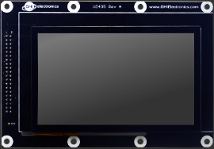
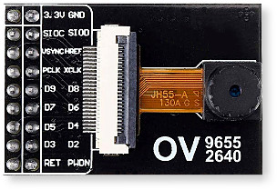
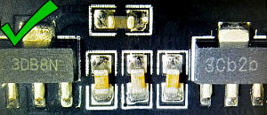
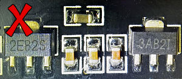

# SITCore Dev Boards
---

We offer two development boards making it possible to start programming your application within minutes without designing or building new hardware. These boards are not only suitable for prototypes, but for short production runs as well.

## SITCore SC20100S Dev Board

Ordering Part Number: SCDEV-20100S

[Schematic]()

The SC20100S Dev Board includes an SC20100S soldered to the board and a built in 1.8 inch color serial display. It has three 40 pin socket headers for connecting peripherals and a display. Peripheral connectors include external power, Ethernet, CAN, USB host and client, RTC backup battery, DCMI interface and an SD card slot.  It also has a buzzer, LEDs, a reset button, and user programmable boot buttons.

To start development using the SC20100S Dev Board, just connect the board's USB Client port to a host computer using a USB-C cable. Go to the [Getting Started](../../software/tinyclr/getting-started.md) page in the TinyCLR section of the documentation page for further instructions.

The board can be powered through either the USB client connectors or the barrel jack. Always use the barrel jack for power when using displays, especially the larger ones. USB does not provide sufficient power needed for displays.

> [!Note]
> All boards with a barrel power jack accept a 5.5 x 2.1 mm power plug. The pin is positive, the sleeve is negative. While these boards accept a wide voltage range, they use linear voltage regulators that run hotter with higher input voltages. Generally we recommend an input voltage of 6 to 12 volts, but if your project draws a lot of current, use a lower voltage to keep the regulator cooler. A one amp power supply should provide enough current for most needs.

## SITCore SCM20260D Dev Board

Ordering Part Number: SCDEV-20260D

[Schematic]()

The SCM20260D Dev Board is the fastest and easiest way to start developing with the SCM20260D. This board includes an SCM20260D DIMM module and a 4.3 inch capacitive touch display. It provides standard connectors for input/output, and three 40 pin socket headers for connecting peripherals and a display. Peripheral connectors include external power, Ethernet, CAN, USB host and client, RTC backup battery, DCMI interface and an SD card slot.  It also has a buzzer, LEDs, a reset button, and user programmable boot buttons.

To start development using the SCM20260D Dev Board, just install the module on the board, plug in the display (if needed), and connect the board's USB Client port to a host computer using a USB-C cable. Go to the [Getting Started](../../software/tinyclr/getting-started.md) page in the TinyCLR section of the documentation page for further instructions.

The board can be powered through either the USB client connectors or the barrel jack. Always use the barrel jack for power when using displays, especially the larger ones. USB does not provide sufficient power needed for displays.

> [!Note]
> All boards with a barrel power jack accept a 5.5 x 2.1 mm power plug. The pin is positive, the sleeve is negative. While these boards accept a wide voltage range, they use linear voltage regulators that run hotter with higher input voltages. Generally we recommend an input voltage of 6 to 12 volts, but if your project draws a lot of current, use a lower voltage to keep the regulator cooler. A one amp power supply should provide enough current for most needs.

### Display Options

One of the headers on the SCM20260 Dev board includes all necessary parallel display signals. It also includes I2C and a couple of GPIOs allowing for support of capacitive touch panels. Out-of-the-box, the SCM20260 Dev board includes a 4.3" display with capacitive touch.

* Display Module: [ER-TFT043-3](https://www.buydisplay.com/)
* Touch Panel: [ER-TPC043-2](https://www.buydisplay.com/)

[Schematic](http://files.ghielectronics.com/downloads/Schematics/Systems/UD435%20Rev%20A%20Schematic.pdf)

This display module has a 4.3" 480x272 TFT display with a capacitive touch screen. It plugs directly into the SCM20260D Dev Board and uses I2C1 for capacitive touch and PJ14 for the touch interrupt. The backlight is controllable through PA15.

The [TinyCLR Samples repo](https://github.com/ghi-electronics/TinyCLR-Samples) has usage examples. You can learn more in the [Graphics](../../software/tinyclr/tutorials/graphics.md) and [Display](../../software/tinyclr/tutorials/displays.md) sections of the TinyCLR tutorials.

See below for the display configuration values:

Property | Value
---------|---------
Width | 480
Height | 272
DataFormat | RGB565
Pixel Clock Rate | 8 MHz <= x <= 16MHz
Pixel Polarity | low
DataEnable Is Fixed | false
DataEnable Polarity | low
Horizontal Back Porch | 46
Horizontal Front Porch | 16
Horizontal Sync Polarity | low
Horizontal Sync Pulse Width | 1
Vertical Back Porch | 23
Vertical Front Porch | 7
Vertical Sync Polarity | low
Vertical Sync Pulse Width | 1

### Camera Options

The SC20260 SoC and its related SoMs include a parallel Digital Camera Interface. The Dev Board exposes the camera signals on a dedicated header. While any compatible display can be connected, the pinout matches the popular OV9655 breakout board, available from many sources around the web and shown below:

It is important to note that some of these breakout boards ship with voltage regulators that don't seem to work properly, while others work well. Please understand that these are just our observations -- we cannot guarantee the functionality or quality of any third party products.

Here are images of OV9655 modules where one works and the other doesn't.

The good modules have regulators labeled "3DB8N" and "3Cb2b:"

.

The bad modules have voltage regulators labeled "2EB2S" and "3AB2I:"

### Demo Program

The SITCore SCM20260D Dev Board ships with a demonstration program that can be found on our [TinyCLR-Samples](https://github.com/ghi-electronics/TinyCLR-Samples) GitHub repository.

> [!Tip]
> There are two power LEDs next to the USB connector for 3.3V and 5V. They are useful to check that you have supplied the necessary power.

***

You can visit our main website at [**www.ghielectronics.com**](http://www.ghielectronics.com) and our community forums at [**forums.ghielectronics.com**](https://forums.ghielectronics.com/).