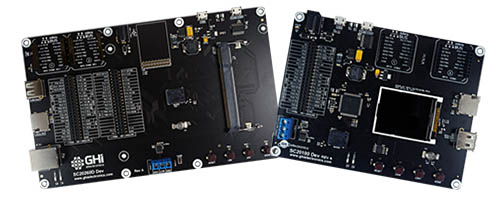

# SITCore Dev Boards
---

We offer two development boards making it possible to start programming your application within minutes without designing or building new hardware. These boards are not only suitable for prototypes, but for short production runs of products as well.

## SITCore SCM20260D Dev Board

Ordering Part Number:

[Schematic]()

The SCM20260D Dev Board is the fastest and easiest way to start developing with the SCM20260D. This board includes the SCM20260D DIMM module and a 4.3 inch capacitive touch display. It provides standard connectors for input/output, and three 40 pin socket headers for connecting peripherals and a display. Peripheral connectors include external power, Ethernet, CAN, USB host and client, RTC backup battery, DCMI interface and an SD card slot.  It also has a buzzer, LEDs, a reset button, and user programmable boot buttons.

To start development using the SCM20260D Dev Board, just install the module on the board, plug in the display (if needed), and connect the board's USB Client port to a host computer using a micro USB cable. Go to the [Getting Started](../../software/tinyclr/getting-started.md) page in the TinyCLR section of the documentation page for further instructions.

The board can be powered through either the USB connectors or the barrel jack. Always use the barrel jack for power when using displays, especially the larger ones. USB does not provide sufficient power needed for displays.

> [!Note]
> All boards with a barrel power jack accept a 5.5 x 2.1 mm power plug. The pin is positive, the sleeve is negative. While these boards accept a wide voltage range, they use linear voltage regulators that run hotter with higher input voltages. Generally we recommend an input voltage of 6 to 12 volts, but if your project draws a lot of current, use a lower voltage to keep the regulator cooler. A one amp power supply should provide enough current for most needs.

### UCD-D43-A (Included with SCM20260D Dev Board)

* Display Module: [ER-TFT043-3](https://www.buydisplay.com/)
* Touch Panel: [ER-TPC043-2](https://www.buydisplay.com/)

[Schematic](http://files.ghielectronics.com/downloads/Schematics/Systems/UD435%20Rev%20A%20Schematic.pdf)

This display module has a 4.3" 480x272 TFT display with a capacitive touch screen. It plugs directly into the SCM20260D Dev Board and uses I2C for capacitive touch. The backlight is controllable through ?. The capacitive touch controller is connected to I2C ? with the interrupt pin on ?.

The [TinyCLR Samples repo](https://github.com/ghi-electronics/TinyCLR-Samples) has usage examples. You can learn more in the [Graphics](../../software/tinyclr/tutorials/graphics.md) and [Display](../../software/tinyclr/tutorials/displays.md) sections of the TinyCLR tutorials.

See below for the display configuration values:

Property | Value
---------|---------
Width | 480
Height | 272
DataFormat | RGB565
Pixel Clock Rate | 8 MHz <= x <= 16MHz
Pixel Polarity | low
DataEnable Is Fixed | false
DataEnable Polarity | low
Horizontal Back Porch | 46
Horizontal Front Porch | 16
Horizontal Sync Polarity | low
Horizontal Sync Pulse Width | 1
Vertical Back Porch | 23
Vertical Front Porch | 7
Vertical Sync Polarity | low
Vertical Sync Pulse Width | 1

### Demo Program

The SITCore SCM20260D Dev Board ships with a demonstration program that can be found on our [TinyCLR-Samples](https://github.com/ghi-electronics/TinyCLR-Samples) GitHub repository.

## SITCore SC20100S Dev Board

Ordering Part Number:

[Schematic]()

The SC20100S Dev Board includes a SC20100S soldered to the board and a built in 1.8 inch color serial display. It has three 40 pin socket headers for connecting peripherals and a display. Peripheral connectors include external power, Ethernet, CAN, USB host and client, RTC backup battery, DCMI interface and an SD card slot.  It also has a buzzer, LEDs, a reset button, and user programmable boot buttons.

To start development using the SC20100S Dev Board, just connect the board's USB Client port to a host computer using a micro USB cable. Go to the [Getting Started](../../software/tinyclr/getting-started.md) page in the TinyCLR section of the documentation page for further instructions.

The board can be powered through either the USB connectors or the barrel jack. Always use the barrel jack for power when using displays, especially the larger ones. USB does not provide sufficient power needed for displays.

> [!Note]
> All boards with a barrel power jack accept a 5.5 x 2.1 mm power plug. The pin is positive, the sleeve is negative. While these boards accept a wide voltage range, they use linear voltage regulators that run hotter with higher input voltages. Generally we recommend an input voltage of 6 to 12 volts, but if your project draws a lot of current, use a lower voltage to keep the regulator cooler. A one amp power supply should provide enough current for most needs.

> [!Tip]
> There are 2 LEDs by the USB connector, for 3.3V and 5V. They are useful to check that you have supplied the necessary power.

***

You can visit our main website at [**www.ghielectronics.com**](http://www.ghielectronics.com) and our community forums at [**forums.ghielectronics.com**](https://forums.ghielectronics.com/).