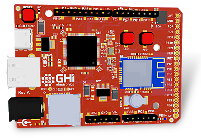
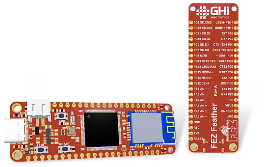
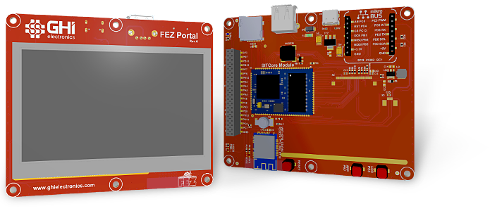
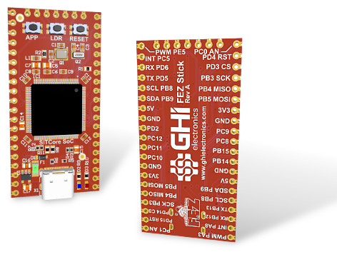

# Single Board Computers
---

We offer multiple single board computers to provide the lowest possible barrier to entering the world of TinyCLR OS. Most of these boards have WiFi and they all support the complete TinyCLR feature set. These boards are great for trying out TinyCLR OS, building prototypes, or incorporating into products.

|                            |                 |                 |                 |                         |               |
|----------------------------|-----------------|-----------------|-----------------|-------------------------|---------------|
|                            | **FEZ Bit**     | **Fez Duino**   | **FEZ Feather** | **Fez Portal**          | **FEZ Stick** |
| **Core**                   | SC20100S        | SC20100S        | SC20100S        | SC20260N                | SC20100S      |
| **Display**                | 1.8" 160x128    | X               | X               | 4.3" 480x272 Cap. Touch | X             |
| **Click Connectors**       | X               | X               | X               | 1                       | 2             |
| **WiFi**                   | Yes             | Yes             | Yes             | Yes                     | X             |
| **Micro SD**               | Yes             | Yes             | X               | Yes                     | X             |
| **User LED**               | Yes             | Yes             | Yes             | Yes                     | Yes           |
| **Buzzer**                 | Yes             | X               | X               | Yes                     | X             |
| **Accelerometer**          | Yes             | X               | X               | X                       | X             |
| **User Buttons**           | Yes             | Yes             | Yes             | Yes                     | Yes           |
| **USB Client**             | Yes             | Yes             | Yes             | Yes                     | Yes           |
| **USB Host Connector**     | X               | Yes             | X               | Yes                     | Yes           |
| **External Flash**         | X               | 16 MByte        | X               | 16 MByte                | X             |
| **LiPo Charger**           | X               | X               | Yes             | X                       | X             |
| **Power Barrel**           | X               | Yes             | X               | X                       | X             |
|                            |                 |                 |                 |                         |               |
| **GPIO (all support IRQ)** | 19              | 38              | 31              |                         |               |
| **SPI**                    | 1               | 2               | 2               |                         |               |
| **I2C**                    | 1               | 2               | 1               |                         |               |
| **UART**                   | 3 (0 with H.S.) | 5 (2 with H.S.) | 5 (1 with H.S.) |                         |               |
| **CAN**                    | 1               | 1               | 1               |                         |               |
| **PWM**                    | 8               | 12              | 8               |                         |               |
| **ADC**                    | 8               | 11              | 6               |                         |               |
| **DAC**                    | 1               | 2               | 1               |                         |               |
| **SD/SDIP/MMC**            | 1               | 1               | 1               |                         |               |
| **Quad SPI**               | X               | X               | X               |                         |               |
| **USB Host**               | 1               | 1               | 1               |                         |               |
| **USB Client**             | 1               | 1               | 1               |                         |               |
| **Ethernet**               | X               | X               | X               |                         |               |
| **LCD TFT**                | X               | X               | X               |                         |               |
| **Camera**                 | X               | X               | X               |                         |               |

*Note: As many pins share peripherals, not all peripherals will be available.*

## FEZ Bit

The **FEZ Bit**, while seemingly more of a "maker" board, provides a convenient way to easily use the multitude of inexpensive Micro:bit accessories that have flooded the market. As the number of Micro:bit accessories continues to grow, this board will be valued as a way to use these accessories to quickly assemble prototypes and test new product concepts.

[FEZ Bit Schematic](pdfs/fez-bit-rev-b-schematic.pdf)

### FEZ Bit Peripheral Pins

|                   |             |
|-------------------|-------------|
| **User LED**      | PE11        |
|                   |             |
| **Buzzer**        | PB1         |
|                   |             |
| **Accelerometer** | I2C = I2C1  |
|                   |             |
| **SPI Display**   | SPI = SPI4  |
|                   | BL = PA15   |
|                   | CS = PD10   |
|                   | RS = PC4    |
|                   | RST = PE15  |
|                   |             |
| **WiFi**          | SPI = SPI3  |
|                   | IRQ = PA10  |
|                   | CS = PD15   |
|                   | EN = PA8    |
|                   | RST = PA9   |

> [!Note]
> All boards with a barrel power jack accept a 5.5 x 2.1 mm power plug. The pin is positive, the sleeve is negative. While these boards accept a wide voltage range, they use linear voltage regulators that run hotter with higher input voltages. Generally we recommend an input voltage of 6 to 12 volts, but if your project draws a lot of current, use a lower voltage to keep the regulator cooler. A one amp power supply should provide enough current for most needs.

## FEZ Duino

The **FEZ Duino** provides female headers that make use of the popular Arduino pinout. Once again, we are trying to make it as easy and inexpensive as possible to build prototypes and try out new concepts by taking advantage of an existing accessory ecosystem.

[FEZ Duino Schematic](pdfs/fez-duino-rev-b-schematic.pdf)

### FEZ Duino Peripheral Pins

|                   |             |
|-------------------|-------------|
| **User LED**      | PE11        |
|                   |             |
| **WiFi**          | SPI = SPI3  |
|                   | IRQ = PA10  |
|                   | CS = PD15   |
|                   | EN = PA8    |
|                   | RST = PA9   |

## FEZ Feather

The Adafruit Feather form factor boards are made to be stackable and have built in support for LiPo batteries, including a charging circuit. We've watched this form factor quickly gaining popularity, so we decided to make a Feather board of our own. If your project needs to run off of a battery, this board makes it quick and easy to get started. The **FEZ Feather** provides both through hole pads and castellated edges making it both breadboard friendly and easy to build into products.

[FEZ Feather Schematic](pdfs/fez-feather-rev-b-schematic.pdf)

### FEZ Feather Peripheral Pins

|                   |             |
|-------------------|-------------|
| **User LED**      | PE11        |
|                   |             |
| **WiFi**          | SPI = SPI3  |
|                   | IRQ = PA10  |
|                   | CS = PD15   |
|                   | EN = PA8    |
|                   | RST = PA9   |

## FEZ Portal

Already one of our most popular SITCore single board computers, The **FEZ Portal** is a 4.3" 480x272 display with capacitive touch that is programmable in C#. As the display and controller are one unit, it's even easier to make a product with touch as you only have to mount a single board that's only slightly larger than the display.

[FEZ Portal Schematic](pdfs/fez-portal-rev-b-schematic.pdf)

### FEZ Portal Peripheral Pins

|                   |                 |
|-------------------|-----------------|
| **User LED**      | PB0             |
|                   |                 |
| **Buzzer**        | PB1             |
|                   |                 |
| **Display**       | BL = PA15       |
|                   | Touch I2C = I2C1|
|                   | Touch IRQ = PG9 |
|                   |                 |
| **WiFi**          | SPI = SPI3      |
|                   | IRQ = PF10      |
|                   | CS = PA6        |
|                   | EN = PA8        |
|                   | RST = PF8       |

## FEZ Stick

The **FEZ Stick** is simply the least expensive way to easily get started with TinyCLR OS. While providing an inexpensive way for the uninitiated to try TinyCLR OS, we've provided castellated edges as well as through hole pads to make it breadboard friendly and easy to embed into products. Also, there's actually space for two click modules, making this a very versatile board at a very affordable price!

[FEZ Stick Schematic](pdfs/fez-stick-rev-b-schematic.pdf)

### FEZ Stick Peripheral Pins

|                   |             |
|-------------------|-------------|
| **User LED**      | PE11        |

