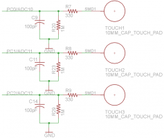
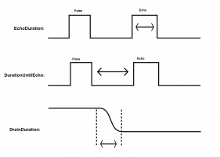

# Pulse Feedback
---

## Introduction
The PulseFeedback class can be found in the GHI.Hardware assembly and can be used in three different modes.

The first mode is EchoDuration. This mode sends a pulse of a given length and state over the provided pin. It then waits for an echo on the other specified pin and measures how long in microseconds that echo pulse was. The echo and pulse pin can be the same if required. The next mode is DurationUntilEcho. It is very similar to EchoDuration, though instead of sending a pulse and measuring the length of the resulting echo, it measures how long it takes until that echo is received.

The below example illustrates sending a pulse of 10us and reading an echo on the same pin where both the pulse and echo are high. A constructor overload is available that allows you to specify a different echo pin and state.

```cs
using GHI.IO;
using Microsoft.SPOT;
using Microsoft.SPOT.Hardware;
using System.Threading;

public class Program {
	public static void Main() {
		var pulse = new PulseFeedback(PulseFeedback.Mode.EchoDuration, true, 10, Cpu.Pin.GPIO_NONE);

		while (true) {
			Debug.Print(pulse.Read().ToString());

			Thread.Sleep(250);
		}
	}
}
```

## Measuring Capacitance
The final mode is DrainDuration. This mode is often used in capacitive touch. When calling Read, the pulse line will be held in the specified state for the specified length and then is set to an input. When a resistor and capacitor are connected to this pin and ground, the pin will fall to ground after a short period of time dependent on the capacitance on the pin. The below image shows a sample circuit. Do note that this mode can only be used with a single pin.



The exact values of the capacitor and resistor will depend on your setup. Generally a resistor in the megaohm range and a capacitor in the low picofarads in acceptable.

## Pin Example
This image shows an example pin capture for each of the modes. It is not drawn to scale. The area marked by the arrows is the time measured for each mode. Remember that the pulse and echo may be on separate pins.



## Timeouts
A call to Read will block until the expected pin state has occurred or the timeout has expired. In the latter case, -1 will be returned. The ReadTimeout property controls this.
