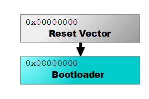

# GHI Electronics Bootloader
---

The GHI Electronics Bootloader is used to update the firmware on our devices. It is the first program to run and unless the device specific LDR pins are set (see device documentation for details), it will execute the firmware on the device (if present). 

The bootloader communicates over a USB (virtual serial port) and a regular serial port. The interface used is controlled by a MOD pin as detailed in [Special Pins](special-pins.md).

## Loading the Firmware

The individual product pages include further instructions on the firmware needed and how to set the board in the loader mode. Once you have downloaded the firmware and set the board in loader mode, use the instructions below to load the firmware.

### Using TinyCLR Config
TinyCLR Config tool includes multiple features developers need to work with TinyCLR OS-enabled devices. It simplifies the firmware update and it includes options for accessing the TinyCLR firmware at runtime.

Using this tool is the recommended path; however, manual installation instructions are also included on this page. Read more on the [TinyCLR Config](../../software/tinyclr/tinyclr-config.md) page.

### Manual Update
TinyCLR Config tool should be used to update the firmware. As a backup, use these instructions:

1. Put your board in bootloader mode. Each product has a specific way to enter the boot loader.
2. Open any terminal software, for example [Tera Term](http://ttssh2.osdn.jp/).
3. Select serial and pick the COM port associated with your board. (If unsure, check Device Manager)
4. Press `V` and then enter. You will see back the boot loader version number (v2.x.x)
5. Press `U` or `X` and then enter. Use `X` for firmware file type GHI and `U` for firmware file type GLB. 
6. Press `Y` to confirm then enter. You will now see `CCCC`...
7. Go to `File` -> `Transfer` -> `XMODEM` -> `Send` and then check the `1K` option.
8. Select the firmware file.
9. When the transfer is complete, reset your board.

## Commands
All commands and results are terminated with CR and LF (\r\n). "OK." will be sent after each successful command.

On startup, a banner is sent that is terminated by "OK.". Once the banner is received, you are free to enter any of the case-insensitive single-character commands described below.

Most commands require confirmation. Send Y or y followed by a new-line to proceed or anything else to cancel.

- V: Returns the current version.
- N: Returns the current device type.
- E: Erases all user sectors of the device.
- R: Runs the firmware if present.
- B: Increases the baud rate in serial mode to 921,600.
- X: Upload a `ghi` file to the device using 1K XMODEM. Only send *.ghi files meant for your device.

## USB Drivers

> [!Tip]
> Only needed for Windows 7 and 8.

File | Date | Status | MD5
--- | --- | --- | ---
[v1.0.0 x64](http://files.ghielectronics.com/downloads/Bootloaders/Drivers/GHI%20Electronics%20Bootloader%20Driver%20x64%20v1.0.0.msi) | 2018-12-27 | Production | 74D66FC4236126A83CCCFE28D556F339
[v1.0.0 x86](http://files.ghielectronics.com/downloads/Bootloaders/Drivers/GHI%20Electronics%20Bootloader%20Driver%20x86%20v1.0.0.msi) | 2018-12-27 | Production | 8BDE68132452E22B14597C0972ABA8FD
