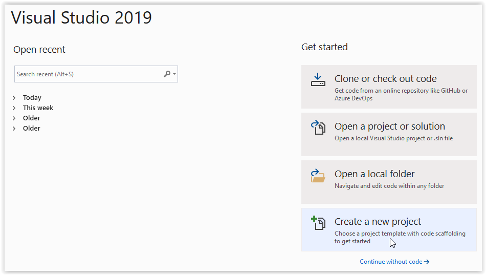
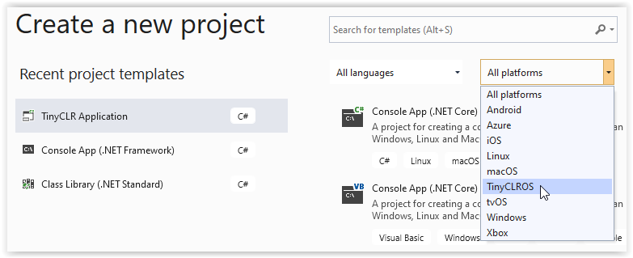
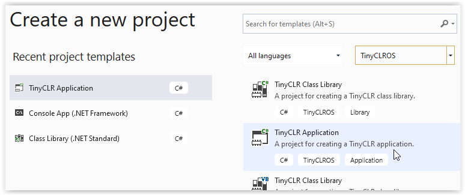
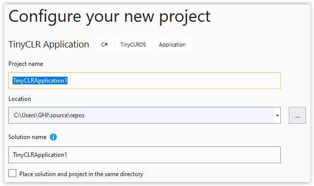
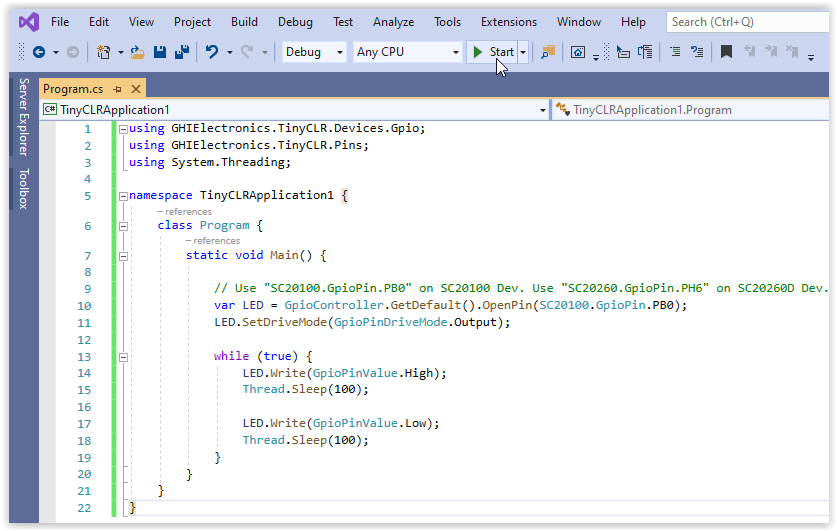
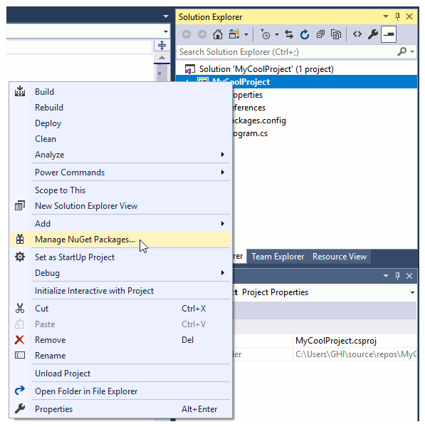
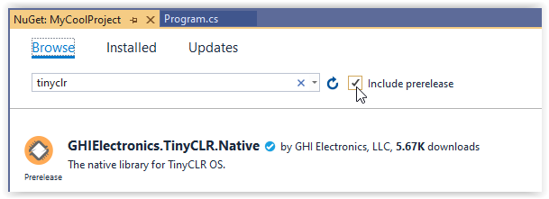

# Getting Started
---


This page explains how to set up the TinyCLR programming environment.  It covers device and computer setup and deployment of a "hello world" program.
> [!Tip]
> If you're an existing user of NETMF and still want to use it in addition to TinyCLR OS, don't worry. TinyCLR is completely independent of NETMF and works side-by-side with no issues.

## Compatible Hardware
TinyCLR OS is made to run on our SITCore line of SoCs, SoMs, dev boards and single board computers. Check out the [**SITCore**](../../hardware/sitcore/intro.md) page in the hardware section of this documentation to find the device best suited for your project.

## TinyCLR Device Setup
To use TinyCLR with a device you must first install the latest version of the TinyCLR firmware on the device.

The TinyCLR firmware includes the Common Language Runtime (CLR) which converts compiled code into machine instructions and manages program execution.  The TinyCLR firmware is also responsible for interacting with Microsoft Visual Studio to load and debug your application programs.

Use the [TinyCLR Config](tinyclr-config.md) tool to update the firmware on your device.

## Development Machine Setup

1. If you don't already have Visual Studio 2019, download and install one of the editions, including the free community edition: [Visual Studio Community 2019](https://www.visualstudio.com/downloads/). You can also use other editions as well.
2. Make sure to select the `.NET desktop development` workload when installing Visual Studio.
3. Download and install the newest TinyCLR Visual Studio Project System by going to `Tools` > `Extensions and Updates...`. In the `Extensions and Updates` dialog box select `Online` in the left panel. Type `tinyclr` into the `Search` text box in the upper right of the window to search for and install the `TinyCLR OS Project System`. You'll need to restart Visual Studio to let the extension installer complete the installation.
    

> [!Note]
> Pre-releases of the Project System are not hosted online but found on the [**Downloads**](downloads.md) page.

## Starting a New Project

Let's blink an LED on a SITCore board.

Open Visual Studio and select `Create a new project`.



In the `Create a new project window`, select `TinyCLROS` from the `platforms` drop down list.



Now select the C# TinyCLR Application template and click the `Next` button.



We're going to stick with the default name and location. If you use a different name, make sure the program's namespace statement matches the namespace of your program. Now click on the "Create" button.



Now cut and paste the following code into the `Program.cs` window. Make sure to install the `GHIElectronics.TinyCLR.Core`, `GHIElectronics.TinyCLR.Devices.Gpio`, `GHIElectronics.TinyCLR.Native`, and `GHIElectronics.TinyCLR.Pins` NuGet packages. If not sure how, the following section explains how this can be done.


```cs
using GHIElectronics.TinyCLR.Devices.Gpio;
using GHIElectronics.TinyCLR.Pins;
using System.Threading;

namespace TinyCLRApplication1 {
    class Program {
        static void Main() {

            //Use "SC20100.GpioPin.PB0" on SC20100S Dev Board.
            //Use "SC20260.GpioPin.PH6" on SCM20260D Dev Board.
            var LED = GpioController.GetDefault().OpenPin(SC20100.GpioPin.PB0);
            LED.SetDriveMode(GpioPinDriveMode.Output);

            while (true) {
                LED.Write(GpioPinValue.High);
                Thread.Sleep(100);

                LED.Write(GpioPinValue.Low);
                Thread.Sleep(100);
            }
        }
    }
}
```

You may have to change line 11 depending on which board you are using.



Make sure your device is plugged into the computer's USB port. Now hit the start button as shown on the above image (or hit the F5 key). If you've done everything correctly, the program will compile and deploy to your device. The left most LED on the dev board should blink if you've done everything correctly.

Congratulations!  You're on your way to becoming a TinyCLR embedded developer!

### The NuGet Packages

NuGet packages are typically hosted online on www.NuGet.org. 

The steps below explain how to add onlione-hosted NuGet libraries to your project. If you are using a pre-release, the libraries must be [downloaded](downloads.md) and installed as a local feed.

1. Start Visual Studio and create a new `TinyCLR Application` under `C# > TinyCLR`. New to Visual Studio or C#? Take a look at the [getting started guide from Microsoft](https://docs.microsoft.com/en-us/dotnet/csharp/getting-started/with-visual-studio).
2. Right click on your Project in the Solution Explorer panel and select `Manage NuGet Packages`.  If the Solution Explorer window is not visible, open it by selecting `Solution Explorer` in the `View` menu. You can also select `Manage NuGet Packages...` in the `Project` menu of Visual Studio.


3. Make sure the package source is set to "Package source" or "All."


4. In the search box type "tinyclr"


5. Selecting the `Browse` tab will show all the TinyCLR NuGet packages. Those installed are noted with a green down arrow in front of the name. 


6. To install one of the packages click on the down arrow to the right of the package version.


You can also select the package and click on the `Install` button in the center panel.


7. Click `OK` to accept the proposed changes.


8. Accept the licensing agreement to install the package.


> [!Note]
> Pre-release libraries are not hosted on NuGet.org, use the local feed feature to fetch the needed libraries from your local machine, found on the [**Downloads**](downloads.md) page.

***
To find the best hardware for your TinyCLR application, go to the [**SITCore**](../../hardware/sitcore/intro.md) page in the hardware section of this documentation.

To learn more about TinyCLR embedded programming check out our [**tutorials**](tutorials/intro.md).

You can also visit our main website at [**www.ghielectronics.com**](http://www.ghielectronics.com) and our community forums at [**forums.ghielectronics.com**](https://forums.ghielectronics.com/).