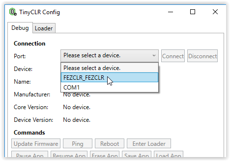
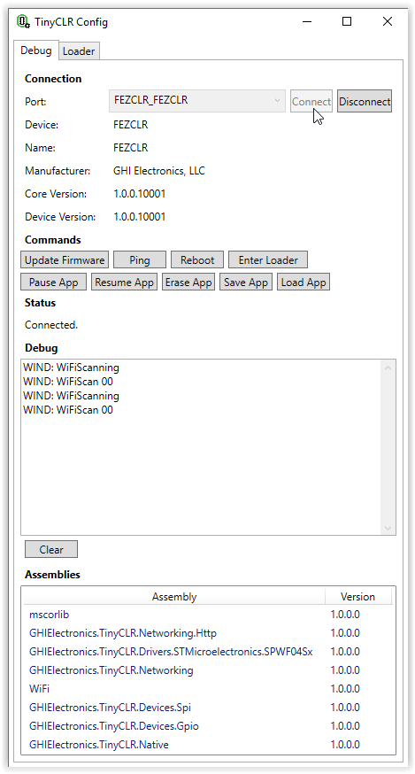
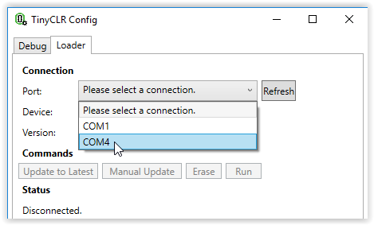

# TinyCLR Config
---
TinyCLR Config is a stand-alone tool to help manage TinyCLR OS devices. The tool is cloud-connected. It automatically finds and downloads newer firmware versions from a list of provided sources. These sources can be on the Internet or local on your computer if you don't have (or don't want) Internet access. The firmware update functionality only works for devices that have [GHI Electronics Bootloader v2](bootloader.md).

You can download TinyCLR Config from the TinyCLR Config section of the [Downloads](downloads.md) page.

## Using TinyCLR Config
After installing TinyCLR Config, the program will be found in the GHI Electronics folder of the Start Menu. Upon starting the program, you will notice two tabs near the top of the window named `Debug` and `Loader`.

The `Debug` mode of the program is used to communicate through the device's USB debug port. TinyCLR firmware must be installed on the device to communicate through the debug interface. The debug mode of TinyCLR Config can be used to update firmware, manipulate your application, save and load binary images of your application, and enter bootloader mode.

The `Loader` mode of the program is used to communicate with devices that are in bootloader mode. You do not need firmware installed to communicate, but GHI Electronics Bootloader v2 must be installed. The loader mode allows you to load or update the firmware, erase the device, and run your application.

### Using Debug Mode

Start TinyCLR Config and plug your device into your computer's USB port. Select your device as show below. We are using the FEZ for this example.

> [!Note]
> You must have GHI Electronics Bootloader v2 and TinyCLR firmware installed on your device to communicate using the `Debug` mode of TinyCLR Config.

.

Hit the `Connect` button. The device, name, manufacturer and firmware versions should be displayed. If you have an application on your device, any debug output will be shown in the `Debug` text box. The assemblies listed in the text box at the bottom of the window should match the libraries (NuGet packages) that were loaded as part of your application.

#### Debug Mode Command Buttons

##### Update Firmware
Updates device firmware to the latest version found from whatever sources have been specified (a default source points to the official GHI Electronics downloads). See [firmware sources](#firmware-sources) below for more information.

##### Ping
Used to ping the device to verify the connection.

##### Reboot
Reboots the device. Will restart any loaded application.

##### Enter Loader
Used to enter bootloader mode. While in bootloader mode you can select the `Loader` tab to communicate with the device in bootloader mode.

##### Pause App
Pauses the application program. Can be used to stop debug output to give you time to read previous debug messages.

##### Resume App
Resumes a paused application.

##### Erase App
Used to erase an application program from a device. Does not erase the firmware or bootloader.

##### Save App
Used to save a binary image of the device application program as a .tca file. Does not save the TinyCLR firmware or the bootloader.

##### Load App
Used to load a previously saved binary image of an application (.tca file) onto your device. Keep in mind that you need to make sure that the device is the same model and is running the same firmware when you load the application that it was when the application was saved.

### Using Loader Mode
Plug the device into your computer's USB port and start TinyCLR Config. To use Loader mode, the device must first be placed into bootloader mode. Devices without firmware installed should boot into loader mode by default. You can also use the `Enter Loader` button in the `Debug` section of TinyCLR Config to put your device in loader mode. You may also assert one of the boot pins to force the device to stay in loader mode on power up -- see your device specifications for details.

> [!Note]
> You must have GHI Electronics Bootloader v2 installed on your device to communicate using the `Loader` mode of TinyCLR Config.

Click on the `Loader` tab of TinyCLR Config. Next to `Port:`, use the drop down text box to select the com port of your device. You may have to click the `Refresh` button if the connection to your device is not shown. When a connection is established, you should see the name and bootloader version of your device.

#### Loader Mode Command Buttons

##### Update to Latest
Updates the device firmware to the latest version found using the same rules as the firmware update section of the `Debug` tab. It will always erase and reload the latest found firmware, regardless of version.

##### Manual Update
Allows you to update from a locally stored firmware file.

##### Erase
Erases the application program and firmware from the device. Does not erase the bootloader.

##### Run
Takes the device out of bootloader mode and starts the firmware on the device.

## Firmware Sources
When TinyCLR Config starts up, it looks for a file called `FirmwareSources.txt` in the same directory as the TinyCLR Config executable itself. If the file isn't present, it's created automatically with one entry pointing to the official GHI Electronics firmware store.

The file is a comma-separated list of sources, one per line. The first value is an integer priority with lower numbers being searched first. Each source is tried until a newer version than the currently flashed version is found. The next value is either `Local` or `Network` which determines where the next value points to: the local disk or the network. The last value is a URI that points to an xml file that defines the list of available firmwares.

The firmware xml list is made up of a list of devices. Each device has a name attribute and firmware list child. Within the firmware list is a list of each available firmware. Each firmware must have an MD5 hash that matches the file pointed to, a version of the form `major.minor.patch`, a release date, and a uri that points to the location of the firmware (the location type must match the location type of the firmware list itself, i.e. local vs network). See the official hosted [FirmwareList.xml](http://files.ghielectronics.com/downloads/TinyCLR/Firmwares/FirmwareList.xml) file for a complete example.

***

Visit our main website at [**www.ghielectronics.com**](http://www.ghielectronics.com) and our community forums at [**forums.ghielectronics.com**](https://forums.ghielectronics.com/).
