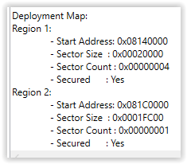
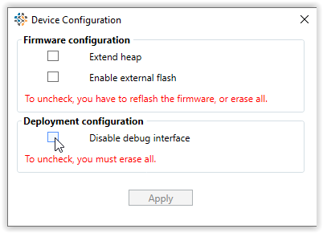

# TinyCLR Config
---

TinyCLR Config is a stand-alone tool to help manage TinyCLR OS devices, including firmware installation and creating encrypted application deployments and loading them onto SITCore devices. There is also a Debug panel that shows any debug data coming from the connected device.

You can download TinyCLR Config from the [Downloads](downloads.md) page.

## Connecting a Device
When TinyCLR Config opens, you will notice a `Device` section near the top of its window. Connect your device to your PC's USB port and click on the `Select a device` drop down text box. The name of your device should appear. Click on the device and hit the `Connect` button.

Once your device is connected, you can ping the device using the `Ping` command in the `Utilities` menu. In the `Assemblies` menu there is an `Assemblies Listing` command that will list all the assemblies installed on the connected device along with their version number. There are also options in the `Utilities` menu to reboot the device, show a deployment map, or update the device configuration.

### Deployment Map

The deployment map can be used to gauge the resources used by your application, but more importantly it allows you to make sure assemblies are stored in secure internal flash memory. See the [IP Protection](tutorials/ip-protection.md) page for more information about secure assemblies.

### Device Configuration

The device configuration options have very important implications for system security. For more information on protecting your application and data, please refer to the [IP Protection](tutorials/ip-protection.md) page of this documentation.

#### Firmware Configuration
The `Extend heap` and `Enable external flash` firmware configuration options both expand internal memory by allowing the use of external memory chips. Once external heap or flash are enabled, you will need to reflash the firmware or completely erase the device to disable external memory.

`Extend heap` extends internal RAM and only works on devices that include external SDRAM. There is also a method, `GHIElectronics.TinyCLR.Native.Memory.ExtendHeap()`, that can be used to extend the heap from within your code. See the [External Memory](tutorials/external-memory.md) page for more information.

`Enable external flash` extends internal flash memory and only works devices that include external flash memory. To extend flash from within an application, use the `GHIElectronics.TinyCLR.Native.Flash.EnableExternalFlash()` method. See the [External Memory](tutorials/external-memory.md) page for more information.

Data stored in external SDRAM or flash memory is less secure than data stored internally. See the [IP Protection](tutorials/ip-protection.md) page for more information.

#### Deployment Configuration
For added security, the debug interface can be disabled. Note that once this is done, you will not be able to update the firmware or debug your application until you completely erase your device. You can update your application code, but only through TinyCLR Config or [In-Field-Update](tutorials/in-field-update.md). You can also disable the debug interface from within your code. Please refer to the [IP Protection](tutorials/ip-protection.md) page for more information about disabling the debug interface.

## Managing Firmware
TinyCLR Config can be used to install new firmware on a connected device. The firmware is the TinyCLR software installed on your device that runs and manages your application program.

To update your firmware, click on the `...` button to the left of the `Update Firmware` button. A dialog box will open so you can select your firmware file. Only .ghi and .glb files will be recognized. After selecting your firmware file, click on the `Update Firmware` button to copy it to your device.

In the `Erase` menu, the `Erase All` selection will erase the firmware on the device, but will also erase the application. While it's not necessary to delete the firmware or the application to install new firmware, it can sometimes help if your device stops working properly.

## Managing Your Application
TinyCLR Config lets you create and deploy encrypted application files. A key is needed to install an encrypted application deployment file on your device. This key can be generated by TinyCLR Config or provided by you.

### Creating a Deployment File
To create an encrypted deployment, you must first have the application installed on your device and the device must be connected to TinyCLR Config. A key is needed to encrypt your deployment file. Either enter a key into the key text box (hexadecimal pairs delimited by hyphens) or just press the `Generate Key` button to generate a random key.

If you want to add a version number to your deployment, enter it in the `Version of created app:` text box.

Click on the `...` button next to the `Create App` button and select a directory and enter a filename for your deployment file. Now press the `Create App` button. The encrypted deployment file and a text file with the key will be saved in the directory you selected.

### Installing a Deployment File
To install an encrypted deployment file on your device, first use TinyCLR Config to connect to your device. Click on the `...` button next to the `Update App` button and select the deployment file (should have a .tca extension). Enter the correct key in the text box next to the `Generate Key` button. The key is a series of hexadecimal pairs that are separated by hyphens. Now click on the `Update App` button. If the key matches the deployment file, the application will be deployed to your device.

***

Visit our main website at [**www.ghielectronics.com**](http://www.ghielectronics.com) and our community forums at [**forums.ghielectronics.com**](https://forums.ghielectronics.com/).
