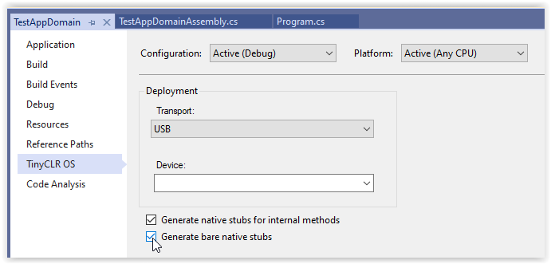

# Application Domain
---
The `AppDomain` class lets you load assemblies from any file stream at runtime. This feature can be used to reduce the need for program flash memory by loading code only as needed from a USB flash drive or SD card, or when you won't know until runtime which assemblies will be used.

The sample code below loads and executes a small assembly from a USB flash drive. To run this sample, start a new project in Visual Studio and copy the first code sample into the `Program.cs` window. Then add a new TinyCLR class named `TestAppDomainAssembly.cs`, and copy the second code sample into this window.

> [!Tip]
> Needed NuGets: GHIElectronics.TinyCLR.Core, GHIElectronics.TinyCLR.Devices.Storage, GHIElectronics.TinyCLR.IO, GHIElectronics.TinyCLR.Native, and GHIElectronics.TinyCLR.Pins.


`Program.cs` class:

```cs
class Program {
    static void Main() {
        var storageController = GHIElectronics.TinyCLR.Devices.Storage.StorageController.
            FromName(GHIElectronics.TinyCLR.Pins.SC20260.StorageController.
            UsbHostMassStorage);

        var drive = GHIElectronics.TinyCLR.IO.FileSystem.Mount(storageController.Hdc);

        var filename = drive.Name + "\\TestAppDomain.pe";

        System.IO.FileStream fsRead = new System.IO.FileStream(filename,
            System.IO.FileMode.Open);

        var assemblyInBytes = new byte[fsRead.Length];

        fsRead.Read(assemblyInBytes, 0, assemblyInBytes.Length);

        var assembly = System.Reflection.Assembly.Load(assemblyInBytes);
        var obj = System.AppDomain.CurrentDomain.CreateInstanceAndUnwrap("TestAppDomain",
            "TestAppDomain.TestAssembly");

        var type = assembly.GetType("TestAppDomain.TestAssembly");

        System.Reflection.MethodInfo mi = type.GetMethod("PrintMessage");
        mi.Invoke(obj, null);
    }
}
```

`TestAppDomainAssembly.cs` class:

```cs
namespace TestAppDomain {
    public class TestAssembly
    {
        public void PrintMessage()
        {
            System.Diagnostics.Debug.WriteLine("Hello from TestAssembly");
        }
    }
}
```

In the `TestAppDomain` properties window (right click on `TestAppDomain` in Solution Explorer and select `Properties`), click on `TinyCLR OS` in the left panel and check the `Generate native stubs for internal methods` and `Generate bare native stubs` boxes. This tells Visual Studio to create the Portable Executable (PE) file that will be copied to the USB flash drive and then executed by the main program.



Now build the project. Inside of the project's directory navigate to the `TestAppDomain/bin/Debug/pe` directory and copy the file `TestAppDomain.pe` to a USB flash drive. Now insert the flash drive into your SITCore board and deploy the program. The main program will load and run `TestAppDomain.pe` from the USB flash drive. If everthing worked, you should see the following in your output window:

```text
'GHIElectronics.TinyCLR.VisualStudio.ProjectSystem.dll' (Managed): Loaded 'TestAppDomain'
   Assembly: TestAppDomain (1.0.0.0)  Hello from TestAssembly
```

