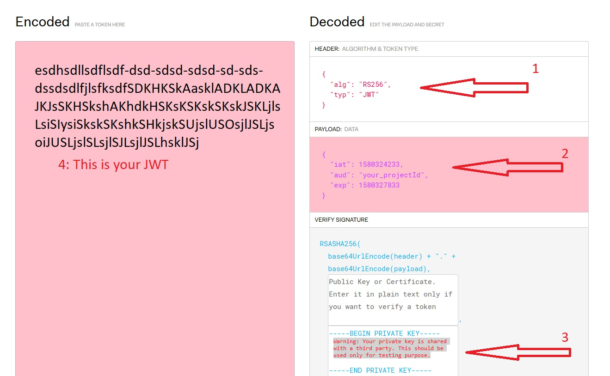

# Google Cloud
---

This example below demonstrates how to communicate with the Google Cloud Platform:

>[!TIP]
>Needed Nugets: GHIElectronics.TinyCLR.Networking.Mqtt

```csharp
static void DoTestGoogleCloudMqtt()
{
    string iotHubName = "mqtt.googleapis.com";
    int iotPort = 8883;

    var projectId = "your project id";
    var cloudRegion = "your region";
    var registryId = "your register id";
    var deviceId = "your device id";

    var clientId = $"projects/{projectId}" +
            $"/locations/{cloudRegion}" +
            $"/registries/{registryId}" +
            $"/devices/{deviceId}";
            
    var message = "My message";

    var caCertSource = UTF8Encoding.UTF8.GetBytes("Your CA certificate");
    var clientCertSource = UTF8Encoding.UTF8.GetBytes("Your Client certificate");

    X509Certificate CaCert = new X509Certificate(caCertSource);
    X509Certificate ClientCert = new X509Certificate(clientCertSource);

    var clientSetting = new MqttClientSetting
    {
        BrokerName = iotHubName,
        BrokerPort = iotPort,
        CaCertificate = CaCert,
        ClientCertificate = null,
        SslProtocol = System.Security.Authentication.SslProtocols.Tls12
    };

    var iotClient = new Mqtt(clientSetting);

    var jwt = "your jwt";

    iotClient.PublishReceivedChanged += (a, b) =>
        { Debug.WriteLine("Publish Received Changed."); };

    iotClient.PublishedChanged += (a, b, c) => { Debug.WriteLine("Published Changed."); }; ;
    iotClient.SubscribedChanged += (a, b) => { Debug.WriteLine("Subscribed Changed."); };
    iotClient.ConnectedChanged += (a) => { Debug.WriteLine("Connected Changed."); };
    iotClient.UnsubscribedChanged += (a, b) => { Debug.WriteLine("Unsubscribed Changed."); };

    var connectSetting = new MqttConnectionSetting
    {
        ClientId = clientId,
        UserName = "unused",
        Password = jwt
    };

    string topic = $"/devices/{deviceId}/events";

    var returnCode = iotClient.Connect(connectSetting);

    if (returnCode == ConnectReturnCode.ConnectionAccepted)
    {
        iotClient.Publish(topic
                , UTF8Encoding.UTF8.GetBytes(message)
                , QoSLevel.LeastOnce
                , false, 1);
    }            
}
```

This example requires projectId, cloudRegion, registryId, and deviceId, which will be available when you register a Google Cloud account.

a client certificate and private key are also provided when you register your account.

You may want to visit https://cloud.google.com/iot/docs/quickstart for more detail.

# JWT

When connect to google cloud, you also need a JWT (JSON Web Token) to be used as password if using MQTT.

For an easy way to generate a JWT visit https://jwt.io/. However, if you are concerned about sharing your private key with a third party site, there are a multitude of other options. 

>[!WARNING]
> By using https://jwt.io/, your private key is shared with a third party. This should be used only for testing purpose."



There are also two fields `iat` (issue at), and `exp` (expire), they contains time in Unix Timestamp format. You can convert them online at https://www.epochconverter.com/

>[!NOTE]
>The google cloud connection accepts a maximum expire time of 24 hours, meaning the timespan between `iat` and `exp` must be less that 24 hours.


