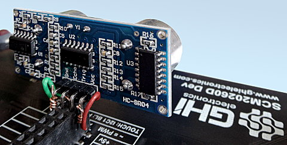
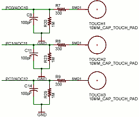

# Signal Control
---


## Pulse Feedback

The PulseFeedback class can be used in three different modes. These modes are used to measure Echo Duration, Duration Until Echo, and Drain Duration.

### Echo Duration


Echo Duration sends a trigger pulse of a given state over the provided pin. It then waits for an echo on the other specified pin and measures the length of that echo pulse. The trigger and echo pins cannot be the same pin.

The following code will read the distance in centimeters from an HC-SR04 ultrasonic distance sensor. This sensor has a trigger pin that is pulsed high to start distance measurement. It has a separate echo pin that the sensor holds high until it receives an echo. Therefore, the time the echo pin is high represents the time it takes for the sound to hit the target and reflect back to the sensor.

To test this code, I plugged the sensor directly into the SCM20260D Dev board and ran a couple short wires for power.



> [!Note]
> The HC-SR04 ultrasonic distance sensor requires a 5 volt power supply. While the module accepts 3.3 volt logic on the Trig and Echo pins, it will not work with a 3.3 volt supply voltage.


```cs
class Program {
    private static GHIElectronics.TinyCLR.Devices.Signals.PulseFeedback pulseFeedback;
    
    static void Main() {
        var distanceTriggerPin = GHIElectronics.TinyCLR.Devices.Gpio.GpioController.
            GetDefault().OpenPin(GHIElectronics.TinyCLR.Pins.SC20260.GpioPin.PA15);

        var distanceEchoPin = GHIElectronics.TinyCLR.Devices.Gpio.GpioController.
            GetDefault().OpenPin(GHIElectronics.TinyCLR.Pins.SC20260.GpioPin.PJ14);

        pulseFeedback = new GHIElectronics.TinyCLR.Devices.Signals.PulseFeedback
            (distanceTriggerPin, distanceEchoPin, GHIElectronics.TinyCLR.Devices.
            Signals.PulseFeedbackMode.EchoDuration) {

            DisableInterrupts = false,
            Timeout = System.TimeSpan.FromSeconds(1),
            PulseLength = System.TimeSpan.FromTicks(100),
            EchoValue = GHIElectronics.TinyCLR.Devices.Gpio.GpioPinValue.High,
            PulseValue = GHIElectronics.TinyCLR.Devices.Gpio.GpioPinValue.High,
        };

        while (true) {
            System.Diagnostics.Debug.WriteLine(ReadDistance().ToString());
            System.Threading.Thread.Sleep(1000);
        }
    }

    public static double ReadDistance() {
        var time = pulseFeedback.Trigger();
        var microseconds = time.TotalMilliseconds * 1000.0;
        var distance = microseconds * 0.036 / 2.0;

        return distance;
    }
}
```

### Duration Until Echo


Duration Until Echo is very similar to Echo Duration, although instead of sending a pulse and measuring the length of the resulting echo, it measures how long it takes until that echo is received. Pulse and echo cannot use the same pins.

The following code reads the distance in centimeters from a Polaroid 6500 Ranging Module. This module is similar to the HC-SR04 distance sensor, however the time it takes for the sensor to pulse the ECHO pin after your device pulses the INIT must be measured.

```cs
class Program {
    private static GHIElectronics.TinyCLR.Devices.Signals.PulseFeedback pulseFeedback;
    
    static void Main() {
        var distanceTriggerPin = GHIElectronics.TinyCLR.Devices.Gpio.GpioController.
            GetDefault().OpenPin(GHIElectronics.TinyCLR.Pins.SC20260.GpioPin.PA15);

        var distanceEchoPin = GHIElectronics.TinyCLR.Devices.Gpio.GpioController.
            GetDefault().OpenPin(GHIElectronics.TinyCLR.Pins.SC20260.GpioPin.PJ14);

        pulseFeedback = new GHIElectronics.TinyCLR.Devices.Signals.PulseFeedback
            (distanceTriggerPin, distanceEchoPin, GHIElectronics.TinyCLR.Devices.
            Signals.PulseFeedbackMode.DurationUntilEcho) {

            DisableInterrupts = false,
            Timeout = System.TimeSpan.FromSeconds(1),
            PulseLength = System.TimeSpan.FromTicks(100),
            EchoValue = GHIElectronics.TinyCLR.Devices.Gpio.GpioPinValue.High,
            PulseValue = GHIElectronics.TinyCLR.Devices.Gpio.GpioPinValue.High,
        };

        while (true) {
            System.Diagnostics.Debug.WriteLine(ReadDistance().ToString());
            System.Threading.Thread.Sleep(1000);
        }
    }

    public static double ReadDistance() {
        var time = pulseFeedback.Trigger();
        var microseconds = time.TotalMilliseconds * 1000.0;
        var distance = microseconds * 0.036 / 2.0;

        return distance;
    }
}
```


### Drain Duration


The final mode is DrainDuration. This mode is often used to implement capacitive touch. When calling Trigger, the pulse line will be held in the specified state for the specified time and then set to an input. When a resistor and capacitor are connected to this pin and ground, the pin will fall to ground after a short period of time dependent upon the size of the capacitor and the size of the resistor in parallel with it. The image below shows a sample circuit. Note that this mode can only be used with a single pin.



The following example illustrates the reading of a capacitive touch sensor. It sends a pulse of 10us to charge a capacitor and then measures the length of time it takes the capacitor to discharge on the same pin. It prints out the total discharge duration in milliseconds. It repeats every second.

```cs
class Program {
    static void Main() {
        var capacitiveSensePin = GHIElectronics.TinyCLR.Devices.Gpio.GpioController.
            GetDefault().OpenPin(GHIElectronics.TinyCLR.Pins.SC20260.GpioPin.PJ14);

        var pulseFeedback = new GHIElectronics.TinyCLR.Devices.Signals.PulseFeedback
            (capacitiveSensePin, GHIElectronics.TinyCLR.Devices.Signals.
                PulseFeedbackMode.DrainDuration) {

            DisableInterrupts = false,
            Timeout = System.TimeSpan.FromSeconds(1),
            PulseLength = System.TimeSpan.FromTicks(100),
            EchoValue = GHIElectronics.TinyCLR.Devices.Gpio.GpioPinValue.High,
            PulseValue = GHIElectronics.TinyCLR.Devices.Gpio.GpioPinValue.High,
        };

        while (true) {
            System.Diagnostics.Debug.WriteLine(pulseFeedback.Trigger().
                TotalMilliseconds.ToString());

            System.Threading.Thread.Sleep(1000);
        }
    }
}
```

## Signal Capture

The SignalCapture class monitors a pin and records any changes (high-low or low-high transitions) of the pin to an array. It is a digital waveform recorder. Each array element is the number of microseconds between each signal change.

When calling Read, it blocks other code from executing until it either fills the input buffer or it has captured the number of transitions specified by the count argument. If your signal is shorter than that, the call will never return. Make sure to request only what you plan to capture.

The following sample code captures the signal generated by pressing LDR button on the SC20100S Dev board. It will attempt to capture 100 transitions, waiting no more than 10 seconds. It will also enable the pull-up resistor on the pin. It will return the initial state of the pin when it started capturing and how many transitions it captured. Note that the signal capture may record button bounces, resulting in a number of transitions in rapid succession.

```cs
var cap = new SignalCapture(SC20100.GpioPin.PE3);
var buffer = new TimeSpan[100];

cap.DisableInterrupts = false;
cap.Timeout = TimeSpan.FromSeconds(10);
cap.DriveMode = GpioPinDriveMode.InputPullUp;

while (true) {
    var count = cap.Read(out var init, buffer);

    Thread.Sleep(100);
}
```

## Signal Generator

SignalGenerator is a digital waveform generator. SignalGenerator works by comparing an internal counter to an array of time values, one by one. When the value of the argument matches the counter, the output pin is changed. The time values are in microseconds.

SignalGenerator can also be used to generate PWM. Unlike the PWM class, SignalGenerator can be used to generate PWM on any available output pin. It does use processor time -- the higher the frequency the more processor time it uses.

At this time, SignalGenerator only operates in blocking mode. While SignalGenerator is running, it will not yield any processor time to other code.

The following sample code will blink the user LED on the SC20100S Dev board four times (for one second each time) every five seconds.

```cs
var gen = new SignalGenerator(SC20100.GpioPin.PE11);

var buffer = new[] {
    TimeSpan.FromSeconds(1),
    TimeSpan.FromSeconds(1),
    TimeSpan.FromSeconds(1),
    TimeSpan.FromSeconds(1),
    TimeSpan.FromSeconds(1),
    TimeSpan.FromSeconds(1),
    TimeSpan.FromSeconds(1),
    TimeSpan.FromSeconds(1),
};

gen.DisableInterrupts = false;
gen.IdleValue = GpioPinValue.Low;

while (true) {
    gen.Write(buffer);

    Thread.Sleep(5000);
}
```